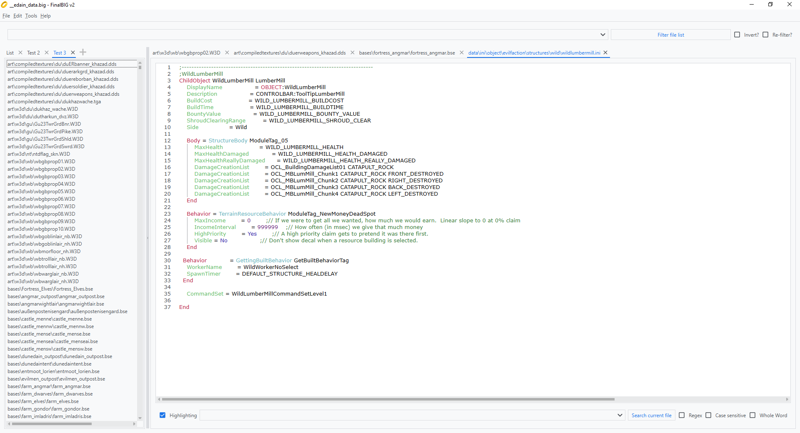
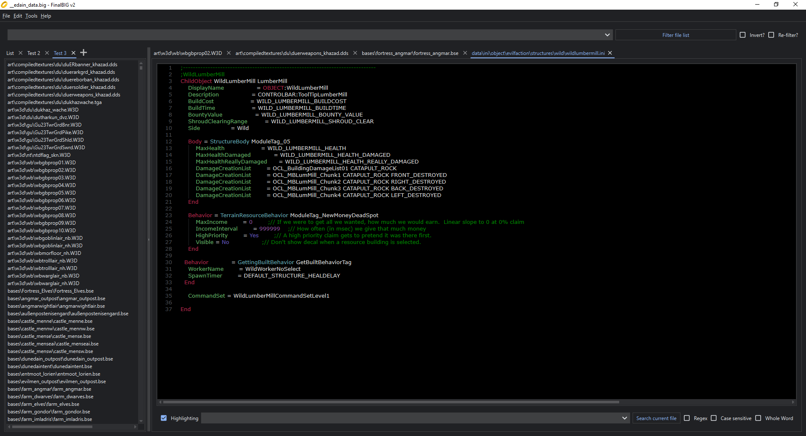
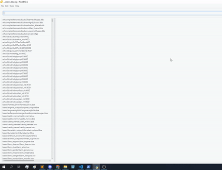

# FinalBIGv2

A PyQt GUI intended to supplant the outdated FinalBIG program in the manipulating of .big archives. FinalBIGv2 can do all the things FinalBIG can and more! It has the following additional features:

* Read support for more than just text files including:
    * Music files
    * Video files
    * CAH files including editing
    * Maps and Base files including editing!
    * W3D models with their skeletons and textures
* Smoother navigation
* Open source
* Syntax Highlighting
* Filtering by filename
* Text search in individual files (including with Regex)
* Text search the entire BIG file
* Adapts to dark mode
* Linux support
* Select multiple files at once from the list with shift, ctrl or just by dragging
* Rename files in place
* Right click menu for ease of access in the file list
* User settings for persistent customisation
* Open files in your default applications or use the internal editor
* Scroll through multiple instances of the file list
* Drag and drop support
* Favorite/unfavorite files
* Update notification
* Workspace saving
* Folder tree visualisation for files
* And many more in the future!

If you have feedback or find any issues, feel free to open a ticket or find me on discord @officialnecro. I can usually be found on quite a few BFME/SAGE servers. You can find me most easily on [Edain's](https://discord.gg/5GhZezy).

## How to use
There is also a public download that's semi-regularly updated: https://www.moddb.com/downloads/finalbigv2

Otherwise you can you build it yourself using the pyinstaller spec

### Running the repository
Don't trust the exe or it doesn't work? No problem
1. Download and install python: https://www.python.org/downloads/release/python-31011/
2. Download the repository as a zip and extract it to a folder
3. Open a terminal and navigate to the folder with `cd PATH` where PATH is the path of the folder
3. Install the dependencies with `python -m pip install -r requirements.txt`
4. Run the application with `python src/main.py`

## Demo
Search entire archive for text

