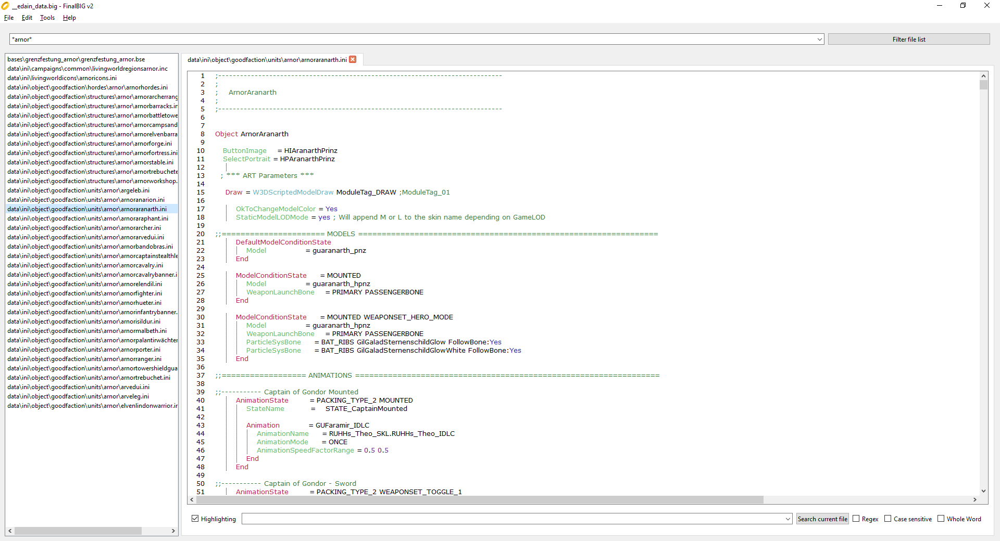

# FinalBIGv2

A PyQt GUI intended to supplant the outdated FinalBIG program in the manipulating of .big archives. FinalBIGv2 can do all the things FinalBIG can and more! It has the following additional features:

* Read support for more than just text files including:
    * Music files (currently disabled)
    * CAH files
    * Maps and Base files including editing!
* Smoother navigation
* Open source
* Syntax Highlighting
* Filtering by filename
* Text search in file (including with Regex)
* Adapts to dark mode
* Linux support
* Select multiple files at once from the list with shift, ctrl or just by dragging
* Rename files in place
* Right click menu for ease of access in the file list
* And many more in the future!

At this very early stage I am mostly looking for feedback so if you have any thoughts feel free to open a ticket or find me on discord @Necro#6714. I can usually be found on quite a few BFME/SAGE servers.

## How to download
A new build is compiled directly from the source everytime a commit is pushed to the repository, you can download it from the [build menu](https://github.com/ClementJ18/finalBIGv2/actions/workflows/main.yml?query=branch%3Amain).

There is also a public download that's semi-regularly updated in case you don't have a GitHub account: https://www.moddb.com/downloads/finalbigv2

## Current Limitations
* Syntax Highlighting gets kinda weird with non-ASCII characters, you can reset it by turning it off and on
* Audio files are currently not supported until I find a way to bundle ffmpeg
* Auto-compile for Linux does not work
* The LUA and XML editor don't switch to dark mode

## To-do
* User plugins?
* Reduce lag from previewing large files
* User settings?
    * Preview
    * Dark mode
    * Encoding
